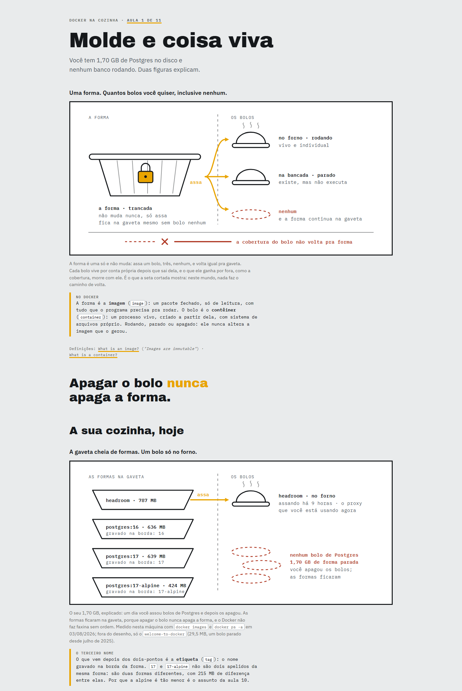

# `/ensinar`

Você já aprendeu alguma coisa numa conversa com IA? De verdade, com aquela
sensação de "agora entendi"? E duas semanas depois não sobrou nada?

Não sobrou porque a conversa evaporou. O chat rolou pra cima, a sessão fechou,
e o que você "aprendeu" nunca existiu fora dela.

`/ensinar` é uma skill do [Claude Code](https://claude.com/claude-code) que
resolve isso do jeito mais teimoso possível: **a sua trilha de aprendizado vira
arquivos no seu disco.** Um mapa que diz quantas aulas faltam. Aulas em HTML
com cara de pôster: imagem grande, poucas palavras, o desenho ensina antes do
texto. Um glossário que cresce com você. E registros do que você de fato
aprendeu, pra que a próxima sessão continue de onde a anterior parou em vez de
recomeçar do zero.

Você fecha o terminal e a trilha continua lá. Meses depois, abre a aula 1 no
navegador e ela ainda ensina.

## Por que ela existe

Eu sempre aprendi por analogia e por desenho. Conceito novo só gruda em mim
quando eu consigo espelhar ele em alguma coisa do dia a dia: uma forma de bolo,
uma tomada, um estagiário. Foi assim na escola, foi assim na carreira, e é
assim até hoje.

Quando a IA chegou, esse jeito de aprender virou superpoder: agora existe
alguém disponível o dia inteiro pra achar a analogia certa, desenhar ela, e
refazer o desenho quando eu não entendo. Essa skill é isso transformado em
método, com regras pra analogia não desmoronar e pro desenho ensinar de
verdade.

Fiz pra quem aprende como eu. E também pra quem nunca tentou aprender assim e
quer experimentar.

## Como é uma aula

A primeira aula da trilha de Docker não abre com "contêineres são unidades
padronizadas de software". Ela abre com um desenho grande de uma **forma de
bolo trancada com cadeado**, e três bolos saindo dela: um no forno, um na
bancada, um prato vazio.



Só depois do desenho vem a tradução: a forma é a **imagem** (`image`), o bolo
é o **contêiner** (`container`). E aí a pergunta que motivou a aula, "por que
tenho 1,70 GB de Postgres no disco e nenhum banco rodando?", já se responde
sozinha: você apagou os bolos; as formas ficaram.

Três termos novos por aula, no máximo. Um quiz pra provar que ficou. Um dado
real medido **da sua máquina**, não de tutorial. E a aula seguinte diz `Aula 2
de 11`, porque você tem o direito de saber quantas faltam.

## De onde vem, e o que foi acrescentado

Esta skill é um fork da [`teach`](https://github.com/mattpocock/skills), de
Matt Pocock, e o esqueleto pedagógico dela é excelente: a missão como âncora de
tudo, fluência × retenção, zona de desenvolvimento proximal, glossário como
língua oficial, registros de aprendizado. Isso está todo aqui, intacto.

Mas usar a original no dia a dia revelou onde ela deixava a desejar. Cada
acréscimo deste fork nasceu de uma dessas dores:

| A dor | O acréscimo |
|---|---|
| Aulas numeradas ao infinito. Você nunca sabia quantas faltavam nem o que era "terminar" | **O mapa vem antes da aula 1.** Toda aula diz `Aula 3 de 7`, nunca `de ?`. |
| Analogia forçada que desmorona três aulas depois | **Analogia só se for isomorfa**: no máximo um ponto de ruptura, declarado. E ela vira o objeto que a figura desenha, não uma frase de efeito. |
| Jargão em inglês comendo a memória de trabalho | **Três termos novos por aula**, batizados na sua língua primeiro: a **camada de base** (`base branch`), nunca o contrário. |
| Explicação que só parece boa porque está em inglês | **O teste da borracha:** apague mentalmente os termos em inglês. A aula ainda ensina? Se não, foi tradução, não ensino. |
| Diagramas onde cor é enfeite | **Cor significa.** Tinta desenha o objeto, âmbar marca o que a figura ensina, tijolo marca onde quebra. E o significado não muda da aula 1 à última. |
| Páginas com cara de documento corporativo | **A pele de aço:** página cinza, figura em painel branco com borda grossa, título em display. Aula é pôster que ensina, e ainda imprime bonito. |

E a língua de ensino é um parâmetro, não uma premissa: cada trilha sai inteira
na língua nativa de quem aprende (as minhas são em português porque a minha é o
português), com as etiquetas técnicas em inglês, porque a documentação e o CLI
vivem em inglês. Quem fala inglês perde só a camada de tradução; o orçamento de
três termos continua valendo igual.

Detalhe da atribuição em [NOTICE.md](./NOTICE.md).

## Instalação

```bash
git clone https://github.com/VictorMarri/ensinar ~/.claude/skills/ensinar
```

Depois, no Claude Code:

```
/ensinar quero aprender Docker
```

A primeira sessão é uma conversa, não uma apostila: a skill pergunta por que
você quer aprender aquilo, mede o seu terreno de verdade (abre seu repositório,
olha sua máquina), e só então desenha o mapa, com o tamanho que a **sua**
missão justifica, de 3 a 12 aulas.

> A skill só carrega se você digitar `/ensinar`. Pedir "me ensina X" numa
> conversa comum não aciona nenhuma dessas regras. É proposital: aula boa
> custa cuidado, e cuidado se pede explicitamente.

## O que fica no seu disco

Um tema, uma pasta, em `~/learning/<tema>/`:

```
MAPA.html            quantas aulas, o que cada uma te dá, onde você está
MISSION.md           por que você quer isso; ancora todas as decisões
lessons/*.html       as aulas com cara de pôster
reference/*.html     glossário e cheat sheets, o que você consulta depois
pratica/*.html       o tema como o mundo cobra lá fora
learning-records/    o que você de fato aprendeu, sessão a sessão
```

Tudo abre no navegador, sem servidor, sem conta, sem app. É seu.

## Pra quem quer abrir o capô

As seis regras completas, com as medidas de contraste e os contratos de cada
arquivo, estão em [`SKILL.md`](./SKILL.md) e [`formatos/`](./formatos/). A
referência canônica da pele é a aula 1 da trilha de Docker
(`0001-molde-e-coisa-viva.html`).

## Licença

O material derivado de Matt Pocock é MIT. Aviso e texto completos em
[NOTICE.md](./NOTICE.md).

Este fork é [MIT](./LICENSE), como o original.
