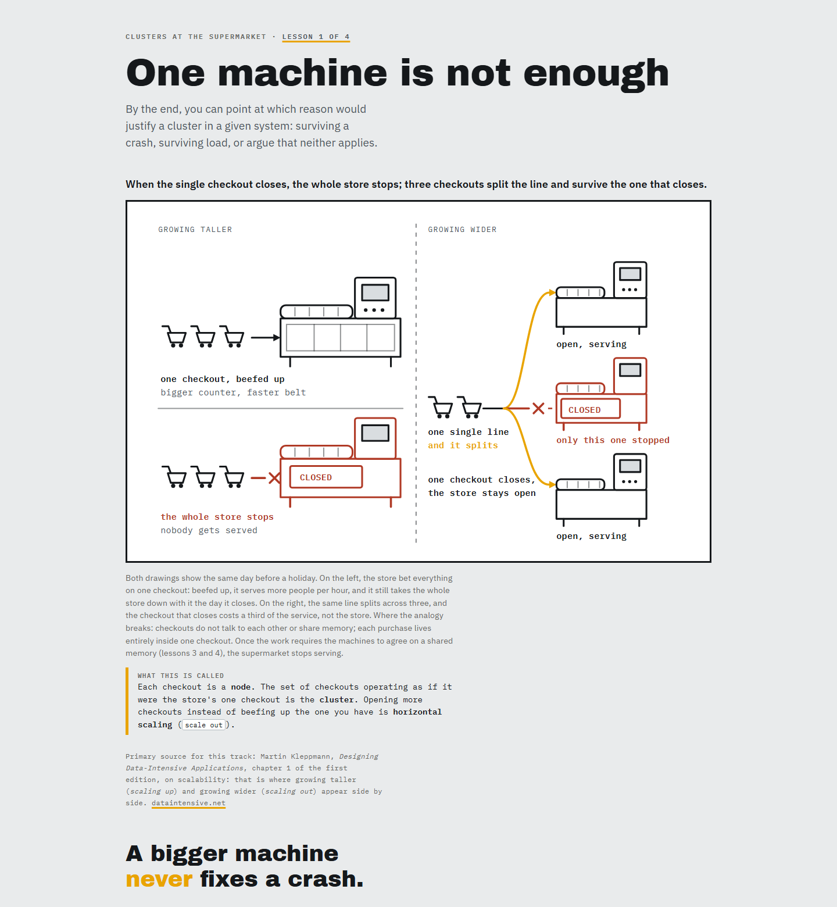

# `/ensinar`

> 🇧🇷 [Leia em português](./README.pt-BR.md)

Ever learned something in an AI conversation? Truly learned it, with that "now
I get it" feeling? And two weeks later, nothing was left?

Nothing was left because the conversation evaporated. The chat scrolled away,
the session closed, and what you "learned" never existed outside of it.

`/ensinar` (Portuguese for *to teach*) is a
[Claude Code](https://claude.com/claude-code) skill that solves this in the
most stubborn way possible: **your learning track becomes files on your disk.**
A map that tells you how many lessons are left. HTML lessons that look like
posters: big drawing, few words, the picture teaches before the text does. A
glossary that grows with you. And records of what you actually learned, so the
next session picks up where the last one stopped instead of starting over.

You close the terminal and the track stays. Months later, you open lesson 1 in
a browser and it still teaches.

## Why it exists

I have always learned through analogy and drawing. A new concept only sticks
for me when I can mirror it onto something from everyday life: a cake mold, a
power outlet, an intern. It was like that in school, like that through my
career, and it is like that today.

When AI arrived, this way of learning became a superpower: now there is
someone available all day to find the right analogy, draw it, and redraw it
when I do not get it. This skill is that turned into a method, with rules to
keep the analogy from collapsing and to make the drawing actually teach.

I built it for people who learn the way I do. And for people who never tried
learning this way and want to see what it feels like.

## What a lesson looks like

The first lesson of a Docker track does not open with "containers are
standardized units of software". It opens with a big drawing of a **cake mold
locked with a padlock**, and three cakes coming out of it: one in the oven,
one on the counter, one empty plate.


Only after the drawing comes the translation: the mold is the **image**, the
cake is the **container**. And then the question that motivated the lesson,
"why do I have 1.7 GB of Postgres on disk and zero running databases?",
answers itself: you deleted the cakes; the molds stayed.

Three new terms per lesson, max. A quiz to prove it stuck. One real number
measured **from your machine**, not from a tutorial. And the next lesson says
`Lesson 2 of 11`, because you have the right to know how many are left.

## Where it comes from, and what was added

This skill is a fork of Matt Pocock's
[`teach`](https://github.com/mattpocock/skills), and its pedagogical skeleton
is excellent: the mission anchoring every teaching decision, fluency versus
retention, zone of proximal development, the glossary as official language,
learning records. All of that is here, intact.

But using the original day after day showed where it fell short. Every
addition in this fork was born from one of those pains:

| The pain | The addition |
|---|---|
| Lessons numbered forever. You never knew how many were left or what "done" meant | **The map comes before lesson 1.** Every lesson says `Lesson 3 of 7`, never `of ?`. |
| A forced analogy that collapses three lessons later | **Only isomorphic analogies**: at most one declared breaking point. And the analogy becomes the object the figure draws, not a turn of phrase. |
| English jargon eating working memory | **Three new terms per lesson**, named in your language first: the *camada de base* (`base branch`), never the reverse. |
| An explanation that only sounds good because it is in English | **The eraser test:** mentally delete the jargon terms. Does the lesson still teach? If not, it was translation, not teaching. |
| Diagrams where color is decoration | **Color means something.** Ink draws the object, amber marks what the figure teaches, brick marks where it breaks. And the meaning never changes from lesson 1 to the last. |
| Pages that look like corporate documents | **The steel skin:** gray page, figures on white panels with thick ink borders, display-face titles. A lesson is a poster that teaches, and it still prints well. |
| Retention named as the goal, never actually practiced | **Every session that resumes a track opens with 2–3 questions from memory**, pulled from the glossary and the earlier quizzes, before the new lesson is written. Spacing is the mechanism; without that moment there is only fluency. |

And the teaching language is a parameter, not a premise: each track is written
entirely in the learner's native language (mine are in Portuguese because my
language is Portuguese), with the technical labels in English, because the
docs and the CLI live in English. English speakers just lose the translation
layer; the three-term budget still applies in full.

The same skill teaching in English, in lesson 1 of a clusters track (the
supermarket that grows taller or grows wider):



Attribution details in [NOTICE.md](./NOTICE.md).

## Installation

```bash
git clone https://github.com/VictorMarri/ensinar ~/.claude/skills/ensinar
```

Then, in Claude Code:

```
/ensinar I want to learn Docker
```

The first session is a conversation, not a handout: the skill asks why you
want to learn this, measures your actual starting point (it opens your
repository, looks at your machine), and only then draws the map, sized to what
**your** mission justifies, from 3 to 12 lessons.

> The skill only loads when you type `/ensinar`. Asking "teach me X" in a
> regular conversation triggers none of these rules. That is on purpose: a
> good lesson costs care, and care is requested explicitly.

## What stays on your disk

One topic, one folder, in `~/learning/<topic>/`:

```
MAPA.html            how many lessons, what each one gives you, where you are
MISSION.md           why you want this; anchors every decision
NOTES.md             your preferences, the track's analogy world, which skin it uses
lessons/*.html       the poster-like lessons
reference/*.html     glossary and cheat sheets, what you consult later
pratica/*.html       the topic as the world tests it out there
learning-records/    what you actually learned, session by session
```

Everything opens in a browser. No server, no account, no app. It is yours.

## Under the hood

The six rules in full, with the contrast measurements and the contract for
every file, live in [`SKILL.md`](./SKILL.md) and [`formatos/`](./formatos/)
(in Portuguese; the rules themselves are language-agnostic). The canonical
reference for the visual identity is lesson 1 of the Docker track
(`0001-molde-e-coisa-viva.html`).

Two scripts in [`scripts/`](./scripts/) do the mechanical part, so that human
attention is spent on the part that teaches. Plain Node, no dependencies:

```bash
node scripts/checar_aula.js ~/learning/docker/lessons/0001-*.html
# checks the mechanical items of the lesson checklist: "Lesson N of ?", links to
# .md files, hex colors inside the SVG, em dashes, the wrong class, dark-theme
# markers. Failures block (exit 1); warnings are for the eye.

node scripts/sincronizar_componentes.js            # compare each track's components against the skill's
node scripts/sincronizar_componentes.js --aplicar  # propagate what diverged
```

Each track keeps its own copy of the components, so the second script is what
keeps twenty lessons across six tracks under the same rules. It skips
`lesson.css` on any track whose `NOTES.md` does not say `pele: nova` — an
unmigrated track keeps the old stylesheet on purpose.

## License

The material derived from Matt Pocock is MIT. Full notice and text in
[NOTICE.md](./NOTICE.md).

This fork is [MIT](./LICENSE), like the original.
